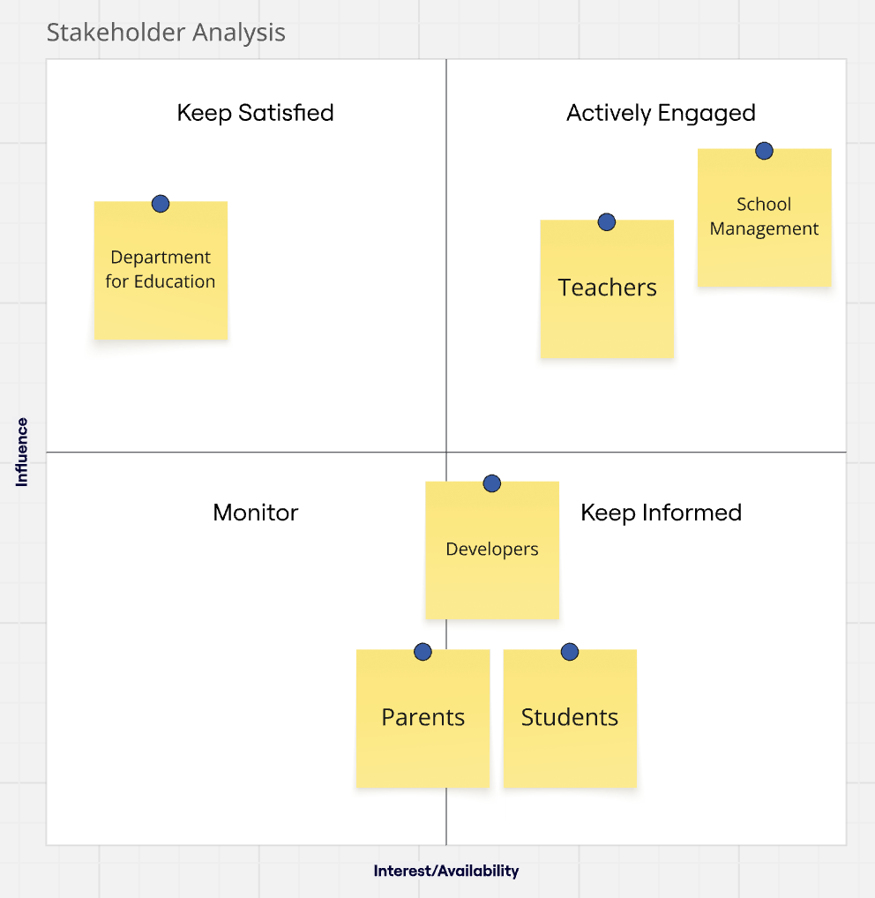
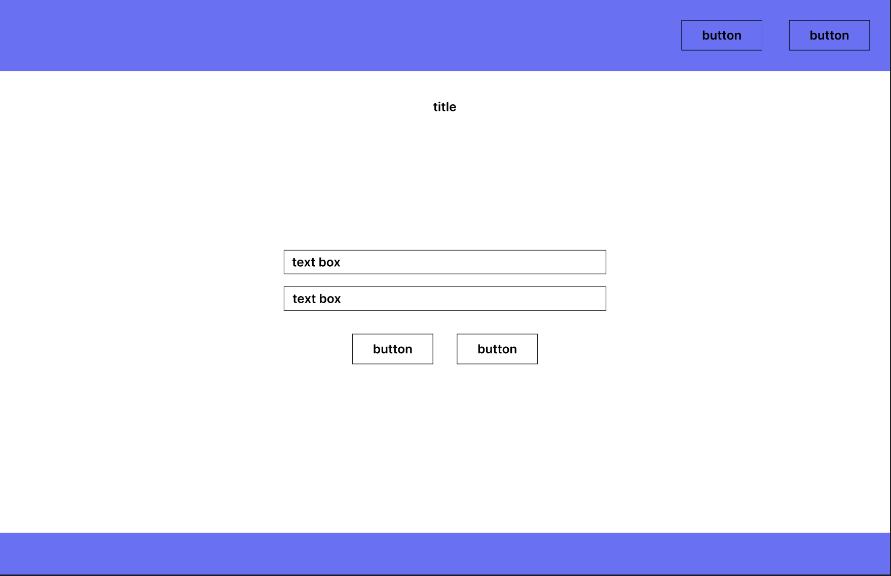
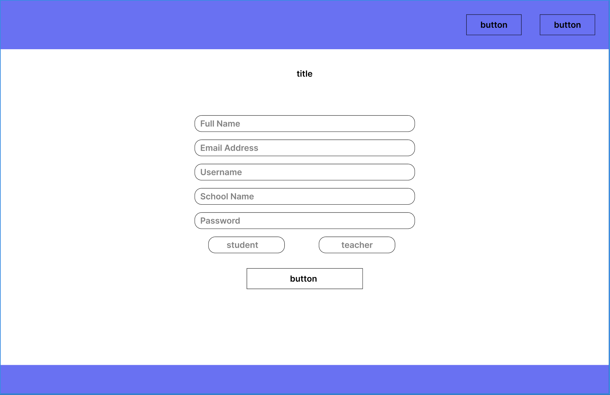
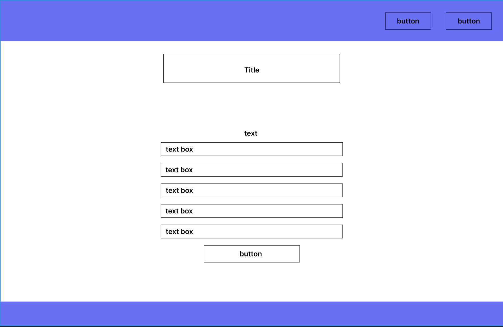
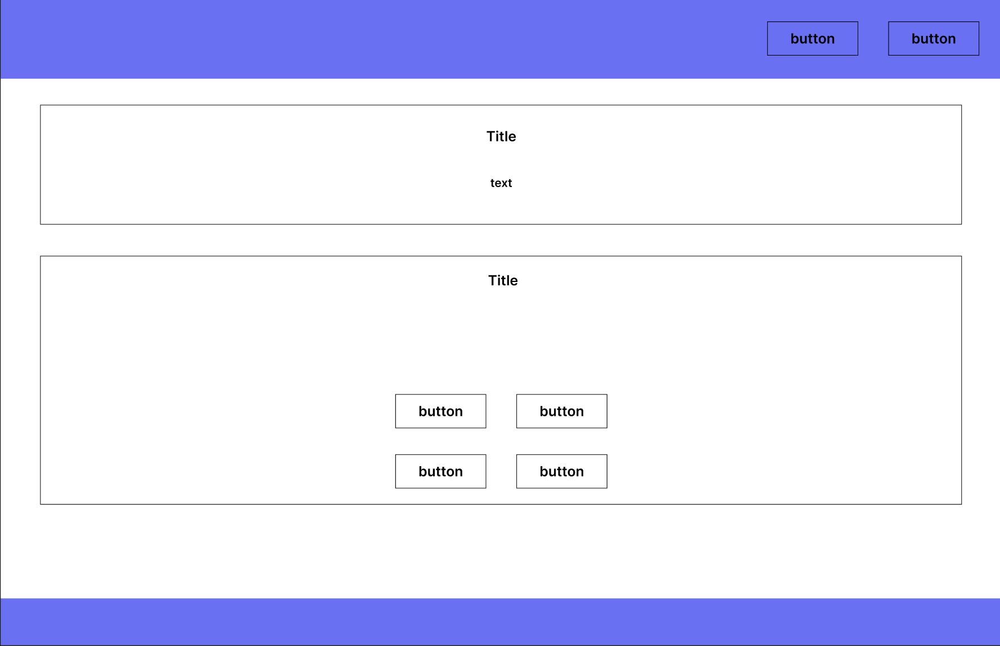
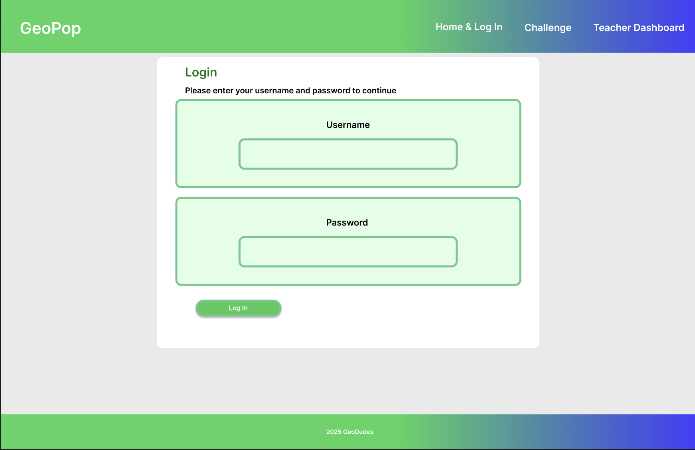
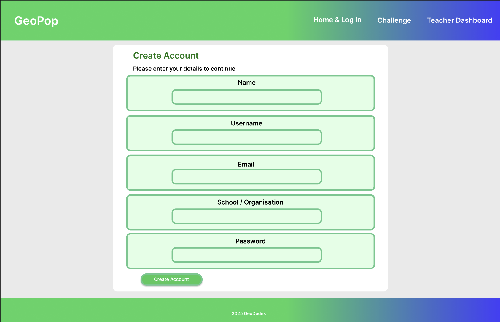
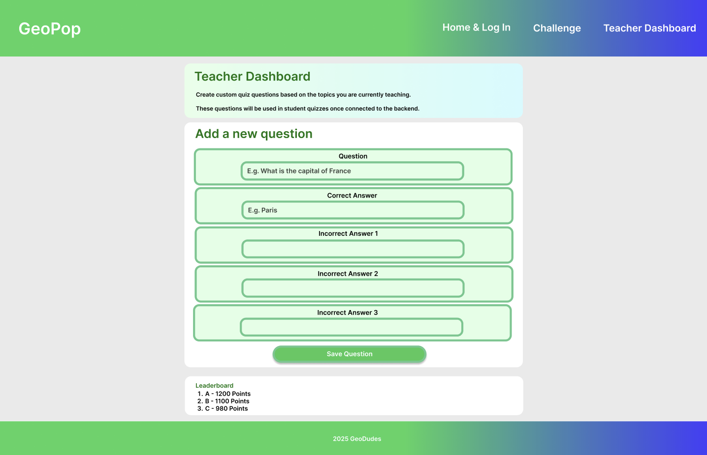
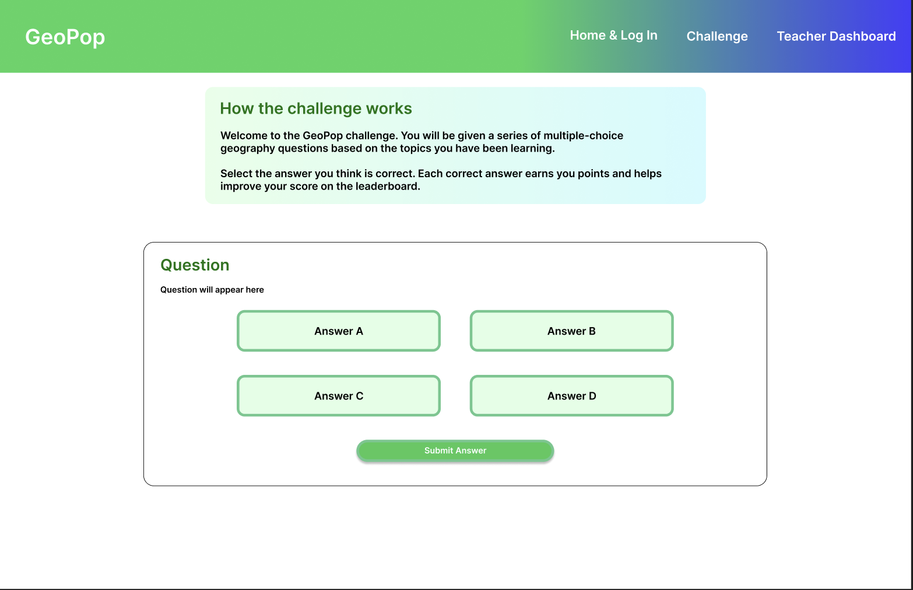

# Project Alpha – GeoPop

An interactive web-based educational platform designed to improve student engagement and knowledge retention in non-STEM subjects such as languages and geography through teacher-created quizzes.

## Table of Contents

- [Problem Statement](#problem-statement)
- [Stakeholder Analysis](#stakeholder-analysis)
- [Solution Analysis](#solution-analysis)
- [Wireframes](#wireframes)
- [High-Level Solution Diagram](#high-level-solution-diagram)
- [Database Schema (ERD)](#database-schema-erd)
- [Technologies Used](#technologies-used)
- [Getting Started](#getting-started)

---

# Problem Statement

*"Student engagement in non-STEM subjects has declined due to repetitive teaching methods and content overload. This project aims to resolve this by creating an interactive, enjoyable learning experience for students."*

--- 
# Stakeholder Analysis

### Identified Stakeholders

The following stakeholders were identified based on the project brief and the proposed solution.

- Students
- Teachers
- Parents
- The Secondary School (Hive Group)
- Department for Education (DfE)
- Developers

---

### Stakeholder & Needs Analysis

| Stakeholder | Goals | Current Issues | Needs from the Solution |
|-----------|------|-----------|------------------|
| Students | Enjoy learning non-STEM subjects | Lessons feel repetitive, content overload | Fun, interactive quizzes |
| Teachers | Improve engagement and assess student understanding of topics | Limited lesson time, repetitive teaching methods | Easy question creation |
| Parents | Child enjoys learning and retains knowledge | Overwhelm, lack of visible progress | Clear structure and learning engagement |
| School Management (Hive Group) | Improve engagement in non-STEM subjects | Falling interest and retention | Solution providing improved results |
| Department for Education (DfE) | Ensure curriculum alignment | Inconsistent depth of learning | Curriculum-aligned educational content |
| Developers | Deliver MVP on time | Time and technical constraints | Clear scope and requirements |

---

### Stakeholder Matrix

---

# Solution Analysis

### Problem Definition

Students across Hive secondary schools are experiencing declining engagement and knowledge retention in non-STEM subjects such as languages and geography. Reduced teaching time and repetitive lesson formats contribute to this issue.

---

### Considered Solution Options

| Solution Option | Description | Pros | Cons |
|---------------|-----------|------|------|
| Teacher-led Quiz Web App | Teachers upload multiple-choice questions for students | Engaging, scalable, curriculum-aligned, achievable MVP | Requires teacher setup |
| Native Mobile App | Dedicated mobile learning application | High engagement | Not feasible within project timeframe |
| Video Learning Platform | Pre-recorded educational videos | Easy to distribute | Passive learning |

---

### Chosen Solution

**Teacher-Controlled Educational Quiz Web Application**

A web-based platform where teachers upload multiple-choice questions related to what has been taught in class. Students complete quizzes, aiming to score as high as possible and get onto the leaderboard for the class. 

---

### Rationale for Chosen Solution

This solution was selected because it:

- Encourages student engagement through interactive gameplay
- Allows teachers to control and customise curriculum content
- Is scalable across multiple schools
- Is achievable within a one-week MVP timeframe using course technologies

---

### Alignment with Stakeholder Needs

| Stakeholder | How the Solution Addresses Their Needs |
|-----------|-----------------------------------------|
| Students | Interactive quizzes improve enjoyment and memory retention |
| Teachers | Simple question management and assessment |
| Parents | Structured learning with clear engagement |
| School Management | Measurable engagement improvements |
| Department for Education | Curriculum-aligned learning content |

---

## Wireframes

Wireframes were created during the planning phase to visualise the user journey, layout, and functionality of the application before development began. Both low-fidelity and high-fidelity wireframes were produced to support iterative design and usability-focused decision making.

---

### Low-Fidelity Wireframes

Low-fidelity wireframes were used to quickly explore layout ideas and core functionality without focusing on visual design. These wireframes helped the team agree on page structure, navigation flow, and essential components for both teacher and student users.

Key goals of the low-fidelity wireframes:
- Define core user flows (login, quiz selection, answering questions)
- Establish page layout and content hierarchy
- Validate functionality before development
---
Login Page

Create Account Page

Teacher Dashboard Page

Challenge Page

---
### High-Fidelity Wireframes

High-fidelity wireframes were created after validating the low-fidelity designs. These wireframes incorporate branding, colour, typography, and realistic UI components to closely represent the final product.

Key goals of the high-fidelity wireframes:
- Improve usability and visual clarity
- Ensure accessibility and readability
- Align the UI with the educational and engaging nature of the application

Login Page

Create Account Page

Teacher Dashboard Page

Challenge Page

---

### Design Decisions

The wireframes informed several key design decisions, including:
- A simple and consistent layout to minimise cognitive load
- Clear call-to-action buttons to guide students through quizzes
- A clean interface to support focus and reduce distraction during learning

---
# High-Level Solution Diagram
---
# Database Schema (ERD)
---
# Technologies Used

### Frontend
- HTML – Structure and layout of the user interface
- CSS – Styling and responsive design
- JavaScript – Client-side logic and interactivity

### Backend
- Node.js – JavaScript runtime environment
- Express.js – RESTful API framework
- PostgreSQL – Relational database for storing users, quizzes, and questions

### Testing
- Jest – Unit and integration testing

### Tooling & Project Management
- VSCode - Programming
- Git & GitHub – Version control and team collaboration
- Figma – Wireframes and UI design
- Postman – API testing and debugging
- Supabase - Database

---

# Getting Started

This section provides a high-level overview of how to access and explore the Project Alpha application.

### Accessing the Application

The deployed version of the application can be accessed via the following link:
t 
🔗 link!!!!!

The live deployment demonstrates the full MVP functionality and was used during the project presentation.

---

### Running the Project Locally

For development or testing purposes, the application can also be run locally.

Detailed setup instructions for each part of the system can be found in the following locations:

- [Backend Setup Guide](backend/README.md)
- [Frontend Setup Guide](frontend/README.md)

These guides include environment setup, dependency installation, and commands required to run each service locally.

